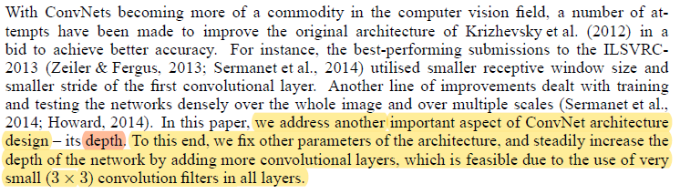

# VGGNet Paper Review

image classification 분야에서 2014년 ILSVRC 대회에 2위의 performance 기록한 VGGNet 연구팀의 관한 paper.

2014년 ILSVRC 대회에서 1위는 GoogLeNet이 차지하였고, 2위는 VGGNet이 차지했다.

하지만, 당시 대회 1위를 차지한 GoogLeNet보다 VGGNet이 더 유명세를 기록했는데, 그 이유는 GoogLeNet의 특별한 Inception 구조를 튜닝하여 사용하기엔 어려움이 있는 반면, VGGNet은 튜닝과 네트워크를 구성하는 방법이 다소 간단하기 때문인 듯함. (개인적인 생각)

# Abstract

저자는 ImageNet Challenge 2014에 16-19 레이어를 가진 CNN 모델을 제출하였고, 좋은 성능을 거두었음.

이러한 성과를 거둔 주된 이유는, very small size인 (3x3) convolution filter들로 네트워크의 depth를 키워 네트워크의 깊이를 늘렸기 때문이라고 함. (increasing depth)

논문의 제목에서도 알 수 있듯이, 저자는 논문에서 VGGNet의 성능 요인 뿐만 아니라 large-scale image recognition에서 deep한 CNN구조의 네트워크가 이후의 CV분야에서 아주 중요하다고 주장한다.

# 1.  Introduction

섹션 1의 두 번째 단락

저자는 이전 cv분야에서 중요하게 다루었던 것들을 구체적으로 언급하며, 이전 모델과 다르게 CNN architecture에서 depth를 중요한 요소로 언급한다.

depth를 통한 성능 향상을 위해 3x3 convolution filter를 사용했다고 말하고 있다.

# 2. ConveNet Configurations 

Input :
224 x 224 x 3 형태의 RGB 이미지를 ConvNet의 input 이미지로 받는다

거기에 training set에 input 이미지의 각 픽셀들의 RGB 값들의 평균을 subtract하는 오직 하나의 pre-processing를 적용했다. (subtracting the mean RGB value)

Convolution layer:
저자는 3x3의 very small receptive field를 사용한다고 언급하였는데, 3x3 receptive field를 very small로 표현한 이유는 이러한 3x3 receptive field가 left/right, up/down, center를 표현하는 가장 최소의 사이즈이기 때문.

또한 1x1 convolution을 적용하고 있는데, 1x1 convolution filter를 사용하면 non-linearity를 향상시킬 수 있기 때문. (차후 ReLU에 관한 내용으로 설명)

최근의 DNN 모델에서 1x1 convolution는 feature-map의 수와 computation time을 줄이는 목적으로 사용되는데, 해당 논문에서는 위 두 가지 목적보다 layer 말단에 ReLU를 적용하여 non-linearity를 얻기 위함이었다.

convolution 연산에 stride = 1로 적용하고 zero-padding 또한 수행했다.

max-pooling은 총 5번 2x2 window에 stride = 2로 적용했다고 한다.

Fully-Connected layer :

convolution layer 스택의 말단에는 3개의 Fully-Connected layer를 배치하여 soft-max function을 통한 activation map을 계산하여 classification을 수행한다. 처음 2개의 Fully-connected layer는 4096개의 채널을 가지고, 마지막 3번째 Fully-connected layer는 ILSVRC dataset의 class value의 개수인 1000개의 채널을 가집니다. 그 후엔, soft-max를 통해 각각의 class에 속하는 확률을 계산했다.

hidden layer :

모든 hidden layer에 ReLU를 적용하여 non-linearity를 적용한다.

여기서 저자는 AlexNet의 연구원들이 사용한 LRN(Local Response Normalization)을 사용하지 않았다고 언급하고 있다. (11-layer VGGNet에 한번 사용) 저자의 실험에서는 LRN은 성능 향상이 없었을뿐더러, 메모리 소비와 computation time을 증가시켰다고 함.

## 2.2	Configureation

모든 convolution layer는 64의 channel에서 512의 channel까지 max-pooling layer를 거치면서 2배씩 증가하게 된다.

Table 2는 parameter의 VGGNet의 parameter수를 나타낸다.

parameter의 수는 _필터 크기 * # of input channel * # of output channel + # of bias_  로 나타내어 지는데, 대부분의 parameter는 3개의 FC layer에 의해 생성되어 A-E의 depth가 깊어지더라도 parameter의 수가 크게 차이 나지 않는다.

## 2.3  Discussion

여기서 이전 CNN 모델과 차이점이 드러난다.

이전에 언급했던 very small 3 x 3 receptive field를 이용한다는 것인데, 저자는 3 x 3 filter 2개를 이용하면 5 x 5 filter를 사용한 것과 동일한 효과(사실, 더 좋은 효과)를 낼 수 있고, 3개를 이용하면 7 x 7 filter를 사용한 것과 동일한 효과를 낼 수 있다고 말한다. 이러한 방법을 이용하면 두 가지 이득을 얻을 수 있다.

-  parameter 수가 현저히 준다는 장점이 있다. (parameter의 수를 줄이면, computation time 을 줄일 수 있고 overfitting을 방지할 수 있음.)

-  3 x 3 filter를 여러 개 사용하므로, activation function인 ReLU를 여러 번 넣어 non-linearity를 향상시킬 수 있다.

C 모델을 보면 1 x 1 convolution layer을 사용한 것을 볼 수 있는데 이는 non-linearity를 향상시키기 위함이다. 즉, 1 x 1 convolution layer를 통과하여도 channel의 수를 동일하게 유지하면서 activation function으로 ReLU를 사용하여 non-linearity를 향상시킨 것.

(이후 최신 논문을 보면, 1 x 1 convolution layer를 사용하여 feature map의 숫자를 줄여 dimension reduction을 위해 사용한다. 하지만, VGGNet에서는 input & output의 수를 동일하게 유지하여 dimension reduction을 수행하지 않았다. (자세한 내용은 CS231n 5강을 참조) )

# 3. Classification Framework
## 3.1 Training

Training 방법:

multinomial logistic regression의 objective function을 mini-batch gradient descent와 back-propagation algorithm을 momentum variable을 적용하여 최적화했다.

- batch-size : 256

- momentum variable : 0.9

- L2 regularization variable : 5*10^-4

- initial learning rate : 10-^-2

- decay learning rate : validation accuracy가 상승하지 않으면 learning rate 0.1씩 감소

- drop-out rate : 0.5

Weight decay에 대해 자세히 알고싶다면 “_A Simple Weight Decay Can Improve Generalization (1992)”; by J. E. Moody_ 논문을 참조

논문에서 AlexNet(_Krizhevsky et al., 2012_)보다 파라미터 수도 많고, network의 depth도 더 깊지만 적은 epoch를 기록했다고 합니다. 그 이유를 architecture 측면에서 아래 두 가지로 나타내고 있습니다.

- 	implicit regularization : factorizing 7 x 7 convolution filter & drop-out

- 	pre-initialization : 11층 layer (Architecture A)를 training하여 얻은 weight를 더 deep한 architecture인 B,C,D network의 layer로 초기화함

pre-initialization을 적용한 것에 대해 자세한 설명을 하고 있다.
-	11층의 layer인 A를 training
-	training하여 얻어진 A의 처음 4개의 Convolution layer와 마지막 3개의 FC layer의 가중치를 다른 architecture에 적용 (transfer learning, pre-initialization)
-	나머지 layer의 weight는 평균이 0, 분산이 10^-2인 정규분포에서 sampling한 값을 사용

##   fixed-size 224 x 224 Input Image & training data augmentation

Input :
-	random하게 SGD iteration마다 rescale된 이미지에서 한번의 crop을 진행
 

Data Augmentation : 
-	training dataset에서 horizontal flip을 random하게 적용
-	RGB shift를 random하게 적용

isotropically-rescaled input :
-	본 논문에서 저자는 ‘isotropically-rescaled training image’라는 표현을 사용했는데, 여기서 isotropy이란 ‘등방성’이란 뜻인데, 등방성이란 ‘물질의 물리적 성질이 방향이 바뀌어도 일정한 성질’이라는 뜻이다. 즉, aspect ratio를 유지하여 rescale을 진행하고 나온 결과 이미지의 side 중 작은 길이를 가지는 side의 길이를 S로 칭한 것이다.

S = 224 :
-	S = 224인 경우에 rescale된 이미지 전체를 input으로 사용

S > 224 :
-	S > 224인 경우에 rescale된 이미지 중 일부를 crop하여 input으로 사용

training scale S를 설정하는 두 가지 방법
-	single-scale training : S 값을 256 / 348 두 가지 값으로 고정한다. 초기에 S = 256 값으로 이미지를 rescale하여 training을 진행하고, training 속도를 올리기 위하여 pre-trained한 , weight의 값을 이용하여 차후에 S = 384로 트레이닝을 진행한다.

-	multi-scale training : S 값을 [S_min, S_max] 사이에서 random sampling을 진행하여 얻는다. (논문의 실험에서 S_min = 256, S_max = 512로 설정했다.) 이는 scale jittering 과정으로 data augmentation 효과를 가져올 수 있으므로, overfitting에 robust하게 된다. training 속도 향상을 위해 S = 384일 때 single-scale을 적용한 model의 weight로 fine-tuning을 진행한다.

이러한 방식으로 data를 scale했을 경우 다음과 같은 이점을 얻을 수 있다.
-	Data augmentation  : Data의 개수를 늘릴 수 있다.

-	다양한 S 값으로 scale된 이미지를 얻어 개체의 특정 부분 및 전체 부분을 학습할 수 있다. 

# Conclusion
VGGNet으로 인하여 training dataset augmentation 방법 등 및 parameter 수를 조절하여 overffiting을 방지하면 네트워크가 deep할수록 classification 정확도가 더 높게 나온다는 것을 알 수 있었다. 
VGGNet 연구는 차후의 연구에 training dataset의 개수 및 overfitting을 방지하면 더 deep한 네트워크를 설계하는 것이 classification에서 유용한 것을 보여줬다.
